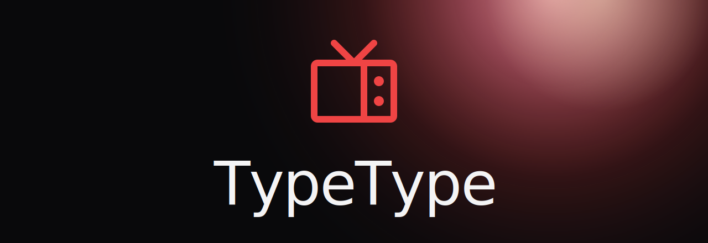
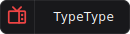

<div align="center">
  
</div>

<div align="center">

[](LICENSE)
[](https://github.com/Priveetee/TypeType)
[](https://github.com/InfinityLoop1308/PipePipeExtractor)

</div>

Documentation for the **TypeType** ecosystem, a self-hostable video platform for
YouTube, NicoNico, and BiliBili. Built with [VitePress](https://vitepress.dev/) and
published to GitHub Pages.

## What's inside

- **Self-hosting** , install and operate the whole stack: Docker Compose setup,
  configuration, OIDC, reverse proxy, maintenance, and troubleshooting.
- **User guide** , everything you can do once it runs: watching, your library,
  finding content, settings, privacy, and signing in.

## Read it

The published documentation lives at **https://priveetee.github.io/Docs-TypeType/**.

## Run the docs locally

```sh
bun install
bun run docs:dev      # http://localhost:5173
```

## Build

```sh
bun run docs:build    # output in docs/.vitepress/dist
bun run docs:preview
```

## Contributing

Contributions are welcome, see [CONTRIBUTING](CONTRIBUTING.md) and the
[Code of Conduct](CODE_OF_CONDUCT.md). Issues are centralised in the main repository:
[Priveetee/TypeType/issues](https://github.com/Priveetee/TypeType/issues).

## License

[MIT](LICENSE) © Priveetee
