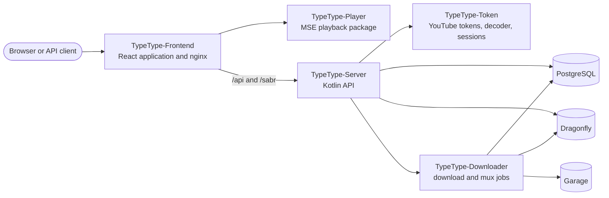

# Project overview

TypeType is a set of independently built services and libraries joined by the
central deployment stack. This section is for contributors, integrators, and
operators who need to understand which repository owns a behavior and how a request
moves through the system.

If you only want to install an instance, start with the
[self-hosting introduction](/self-hosting/introduction). If you use an existing
instance, see the [user guide](/guide/).

## System map

The browser talks to the web container. Its bundled nginx serves the React
application and forwards API, WebSocket, and playback traffic to TypeType-Server.
Server is the application/API boundary behind that public web gateway; Token,
Downloader, PostgreSQL, Dragonfly, and Garage are internal services.

## Public repositories

| Repository | Owns |
| --- | --- |
| [TypeType](https://github.com/TypeType-Video/TypeType) | Compose stack, nginx, installer, updates, rollback, release coordination, and the central issue tracker |
| [TypeType-Frontend](https://github.com/TypeType-Video/TypeType-Frontend) | React routes, interface, settings, account flows, and playback controls |
| [TypeType-Server](https://github.com/TypeType-Video/TypeType-Server) | HTTP API, extraction, accounts, private user data, playback sessions, and integrations |
| [TypeType-Token](https://github.com/TypeType-Video/TypeType-Token) | YouTube PO tokens, player decoding, SABR metadata, subtitles, and remote-login browser sessions |
| [TypeType-Downloader](https://github.com/TypeType-Video/TypeType-Downloader) | Persistent download jobs, media transfer, muxing, and artifacts |
| [TypeType-Player](https://github.com/TypeType-Video/TypeType-Player) | Browser Media Source Extensions pipeline used by the frontend |
| [Docs-TypeType](https://github.com/TypeType-Video/Docs-TypeType) | User, operator, and project documentation |
| [TypeType-Video/.github](https://github.com/TypeType-Video/.github) | Organisation profile and shared public assets |

Read [Repository guide](./repositories) for source-tree entry points, local checks,
licenses, and where a change belongs.

## Important flows

- [Playback and downloads](./playback) explains SABR, the Player package, Token, and
  Downloader boundaries.
- [Branches and releases](./releases) explains `dev`, `main`, component images,
  submodule pins, and the beta/stable channels.
- [Community sources](./community) records the reports and discussions that improved
  both TypeType and this documentation.

## Sources of truth

Use this order when documentation and implementation appear to disagree:

1. The source and tests in the repository that owns the behavior.
2. The central stack's current Compose, nginx, and installer files.
3. The central [issues](https://github.com/TypeType-Video/TypeType/issues) and
   [discussions](https://github.com/TypeType-Video/TypeType/discussions) for known
   behavior, operator experience, and decisions.
4. This site for the supported workflow.

Documentation changes are verified against all three upstream sources before being
presented as stable behavior. An open issue is evidence of a problem, not by itself a
specification; the owning source still decides what the current version does.

## Source references

- [Central Compose stack](https://github.com/TypeType-Video/TypeType/blob/main/docker-compose.yml)
- [Bundled nginx configuration](https://github.com/TypeType-Video/TypeType/blob/main/nginx.conf)
- [Server application wiring](https://github.com/TypeType-Video/TypeType-Server/blob/dev/src/main/kotlin/dev/typetype/server/Application.kt)
- [Frontend source tree](https://github.com/TypeType-Video/TypeType-Frontend/tree/dev/apps/web/src)
