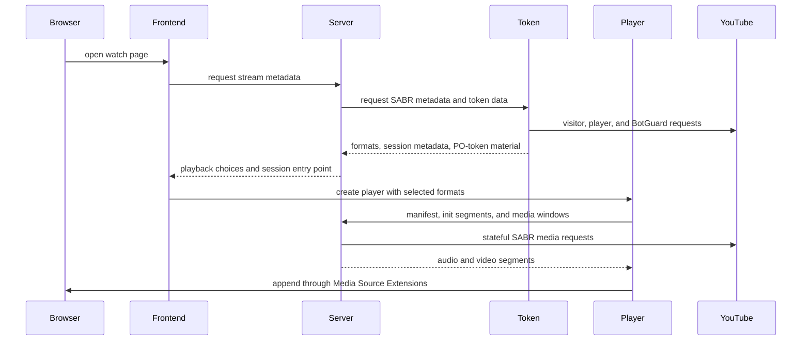
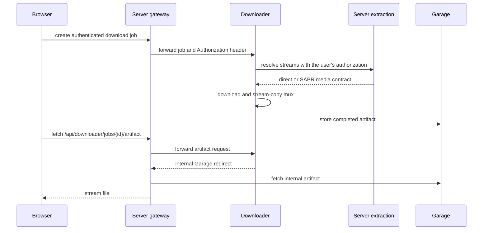

# Playback and downloads

Playback crosses four repositories: Frontend owns the controls, Server owns the
session and public media contract, Token supplies YouTube-specific session material,
and Player owns the browser MSE pipeline. Downloader reuses the Server contract when
a user asks for an offline artifact.

## YouTube playback path



The browser does not receive the upstream SABR URL or talk to Token. Server keeps the
stateful upstream session, format selection, playback position, cached segments, and
recovery generation. Player requests only TypeType-owned manifest and media paths.

## Responsibility by layer

### Frontend

Frontend decides what the person asked for: quality, codec, audio track, captions,
audio-only mode, seek position, autoplay, and player layout. It creates and destroys
the Player engine and converts engine events into visible state.

### Server

Server exposes the playback-session contract under `/sabr/playback/...`. It selects
formats, creates an isolated session token, warms initialization and media data,
tracks playback position, handles seeks and generations, and evicts idle sessions.

For live content, Server and Player follow a moving playback window rather than a
fixed list of segments. A quality or audio-track change creates replacement playback
state at the requested position. The replacement path exists, but
[issue #163](https://github.com/TypeType-Video/TypeType/issues/163) tracks a current
failure where live playback freezes after a quality or codec change.

### Token

Token creates the YouTube-side material needed before Server can build a session:
visitor data, PO tokens, player URL decoding, adaptive format metadata, and the SABR
streaming URL. Its `/youtube/sabr/session` response is internal and is converted into
Server models before anything reaches the browser.

Token is required for current YouTube playback even when remote YouTube login is
disabled. The optional setting controls only the interactive login flow, not the
token and decoder service itself.

### Player

`@typetype/mse` loads the TypeType manifest, initialization data, and segment windows.
It owns MediaSource and SourceBuffer operations, request cancellation, forward and
back-buffer limits, segment scheduling, seek generations, quality changes, live-edge
following, and recovery from stale or interrupted requests.

The package intentionally contains no controls or application state. That boundary
lets playback behavior be tested without the React interface.

## Other media services

Server also wraps PipePipeExtractor for supported non-YouTube services. Depending on
the extracted response, Frontend can use direct media, DASH, HLS, or a TypeType proxy.
Provider-specific extraction stays in Server; Player's TypeType SABR session contract
is specifically the browser pipeline for stateful TypeType playback.

## Download path



The public route is `/api/downloader/...`; the Downloader service itself remains
internal. Its job keeps the user's `Authorization` header so its later extraction
request has the same access as the original browser request.

In the bundled stack, Downloader creates an internal Garage URL. Server recognises
the `garage` host and proxies the artifact instead of sending that private hostname
to the browser. A normal deployment therefore does not need to expose Garage or set
a browser-facing S3 endpoint.

## Diagnosing a deployed version

The bundled nginx exposes the revision of every application image:

```sh
curl -fsS https://watch.example.com/api/version
curl -fsS https://watch.example.com/api/version/server
curl -fsS https://watch.example.com/api/version/token
curl -fsS https://watch.example.com/api/version/downloader
```

Include these four responses when a playback or download report may depend on a
recent component change. Also include whether the instance follows
[main or beta](/self-hosting/beta-and-main).

## Reports that informed this page

The current separation between playback, Token, and container boundaries was made
clearer by [hugoghx's Token deployment investigation](https://github.com/TypeType-Video/TypeType/discussions/156).
Livestream reports such as [issue #145](https://github.com/TypeType-Video/TypeType/issues/145)
and [issue #163](https://github.com/TypeType-Video/TypeType/issues/163) also helped
identify the live-session and quality-change concepts that need to be explicit here.
See [Community sources](./community) for the complete acknowledgements.

## Source references

- [Server SABR routes](https://github.com/TypeType-Video/TypeType-Server/blob/dev/src/main/kotlin/dev/typetype/server/routes/SabrRoutes.kt)
- [Server session store](https://github.com/TypeType-Video/TypeType-Server/blob/dev/src/main/kotlin/dev/typetype/server/services/SabrSessionStore.kt)
- [Server-to-Token SABR client](https://github.com/TypeType-Video/TypeType-Server/blob/dev/src/main/kotlin/dev/typetype/server/services/TypetypeTokenYoutubeSessionClient.kt)
- [Token SABR session implementation](https://github.com/TypeType-Video/TypeType-Token/blob/dev/src/youtube-sabr-session.ts)
- [Player source](https://github.com/TypeType-Video/TypeType-Player/tree/dev/src)
- [Server Downloader gateway](https://github.com/TypeType-Video/TypeType-Server/blob/dev/src/main/kotlin/dev/typetype/server/routes/DownloaderGatewayRoutes.kt)
- [Downloader pipeline](https://github.com/TypeType-Video/TypeType-Downloader/tree/dev/internal/pipeline)
