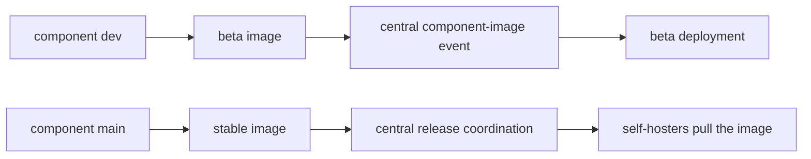

# Branches and releases

TypeType components are developed independently and then assembled by the central
stack. Understanding the distinction between a source branch, a component image,
and a running deployment avoids most version confusion.

## Development and stable lines

| Line | Branch | Container image pattern | Purpose |
| --- | --- | --- | --- |
| Development | `dev` | `typetype-beta`, `typetype-server-beta`, `typetype-token-beta`, `typetype-downloader-beta` | Integration and beta deployment |
| Stable | `main` | `typetype`, `typetype-server`, `typetype-token`, `typetype-downloader` | Released self-hosted stack |

All image names above live under `ghcr.io/typetype-video/` and use the `:latest` tag
unless an override selects another tag or digest.

Most component repositories use `dev` as their default branch. Code pull requests
target `dev`; a release promotion moves the selected work to `main`. The central
TypeType repository uses `main` as its default because it is also the installation
and release entry point.

`latest` is a moving container tag. It identifies the newest image on that channel,
not an immutable release. Record the image digests before updating and use those
digests for rollback, as described in [Roll back an update](/self-hosting/rollback).

## Component image flow



Component workflows build and publish their own images. They then notify the central
repository with the component name, channel, image digest, source revision, and build
version. The central workflow deploys beta automatically. Stable notifications are
recorded; a public or self-hosted stable deployment updates through its own release
or installer process.

## Central submodules

The central repository also contains Git submodules for Frontend, Server, Player,
Token, Downloader, and Docs. A central commit pins one exact source revision for each
component, while `.gitmodules` records `dev` as the branch to follow during active
development.

The submodule tree is useful for source coordination and review. Runtime provenance
must still be checked against the actual container digest or the `/api/version/*`
endpoints, because the Compose defaults select channel images rather than building
all submodules locally.

## Check what is running

From outside the instance:

```sh
curl -fsS https://watch.example.com/api/version
curl -fsS https://watch.example.com/api/version/server
curl -fsS https://watch.example.com/api/version/token
curl -fsS https://watch.example.com/api/version/downloader
```

From the host:

```sh
docker compose images
docker image inspect "$(docker compose images -q typetype-server)" \
  --format '{{index .RepoDigests 0}}'
```

The HTTP responses identify source revisions and build times. The Docker inspection
identifies the immutable image digest. Keep both when documenting or reporting a
release-specific behavior.

## Main and beta deployments

The stable and beta stacks can run side by side with separate Compose project names
and ports. They should not be assumed to run identical component revisions: beta
advances whenever a component's `dev` image is accepted, while stable advances through
the release process.

See [Beta and main](/self-hosting/beta-and-main) for commands and isolation guidance.

## Source references

- [Central submodule configuration](https://github.com/TypeType-Video/TypeType/blob/main/.gitmodules)
- [Central component-image workflow](https://github.com/TypeType-Video/TypeType/blob/main/.github/workflows/component-image.yml)
- [Stable Compose image selection](https://github.com/TypeType-Video/TypeType/blob/main/docker-compose.yml)
- [Beta Compose image selection](https://github.com/TypeType-Video/TypeType/blob/main/docker-compose.dev.yml)
