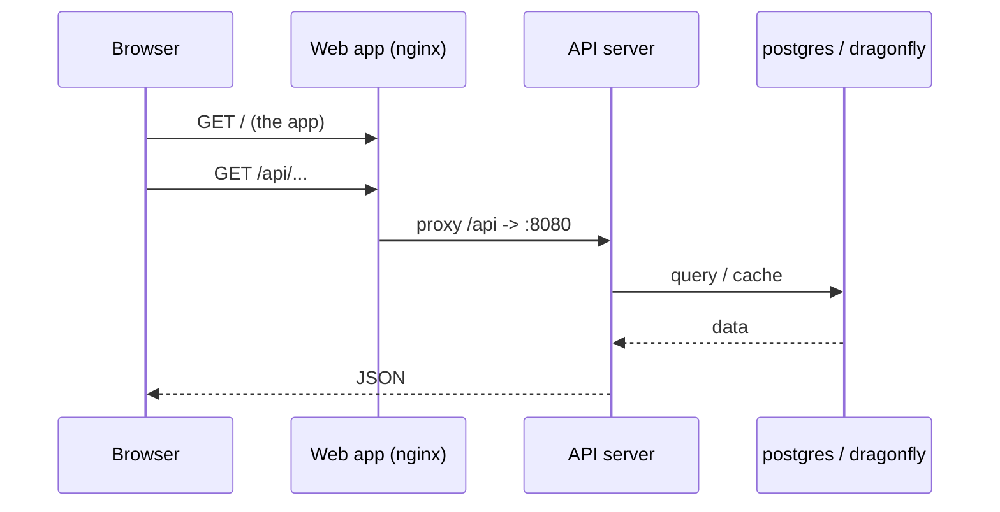
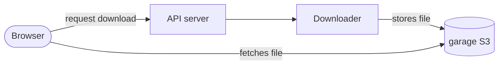

# Architecture

This page explains how the services talk to each other and where your data lives. You
do not need it to install TypeType, but it makes operating and debugging the stack far
easier.

## Networking

Compose puts every service on one private network and gives each a DNS name equal to
its service name (`typetype-server`, `postgres`, `garage`, ...). Services reach each
other by those names, never through host ports.

Only a few ports are **published** to the host:

| Published | Service | Who needs it |
| --- | --- | --- |
| `HOST_PORT_WEB` (8082) | web app | your users (put the reverse proxy here) |
| `HOST_PORT_SERVER` (8080) | API server | optional, direct API access |
| `HOST_PORT_TOKEN` (8081) | remote login | only if you use that feature |
| `HOST_PORT_GARAGE_S3` (3900) | object store | only if downloads are served directly |

Everything else (`postgres`, `dragonfly`, the downloader) stays internal.

## Request path

A normal page view:

The web container serves the static app and proxies anything under `/api/` to the
server, including WebSocket upgrades. That is why your external reverse proxy only
ever needs to point at the web container.

## Download path

The downloader writes the finished file to Garage. The browser then fetches it using
`DOWNLOADER_S3_PUBLIC_ENDPOINT`, which is why that value must be reachable from the
client, not `localhost`, on a public deployment.

## Where data lives

State is kept in named Docker volumes, so `docker compose down` (without `-v`) keeps
everything:

| Volume | Contents |
| --- | --- |
| `postgres_data` | accounts, history, playlists, settings |
| `garage_meta`, `garage_data` | the object store (downloads) |
| `typetype_secrets` | the auto-generated secrets |

Back these up to preserve a deployment. See [Maintenance](./maintenance#backups).

## Secrets

The `typetype-secrets` init container generates two secrets into the
`typetype_secrets` volume on first start. The server and the remote-login service read
them from there. Values you set in `.env` take priority, and placeholder text
(`SET_ME_...`) is ignored, so leaving the placeholders untouched is safe. See
[Configuration](./configuration#secrets-handled-automatically).
