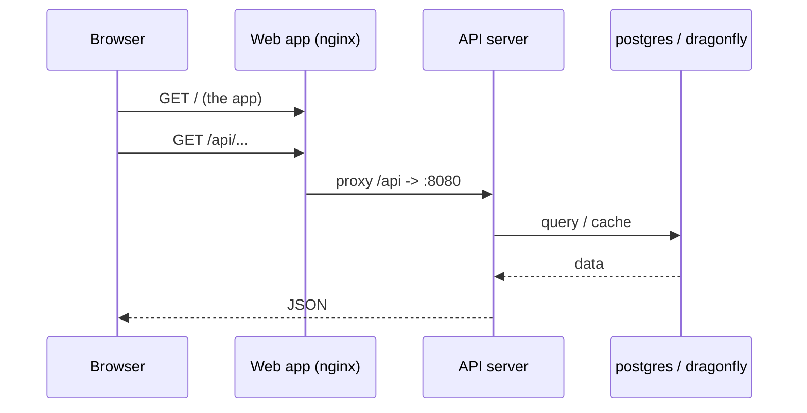
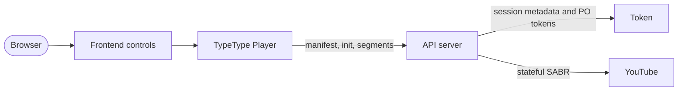
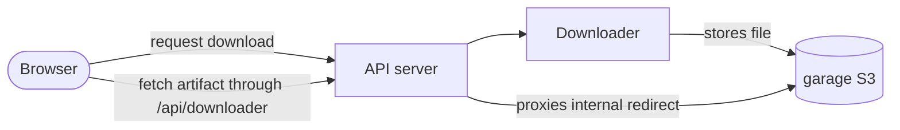

# Architecture

This page explains how the services talk to each other and where your data lives. You
do not need it to install TypeType, but it makes operating and debugging the stack far
easier.

## Networking

Compose puts every service on one private network and gives each a DNS name equal to
its service name (`typetype-server`, `postgres`, `garage`, ...). Services reach each
other by those names, never through host ports.

Only a few ports are **published** to the host. Internal diagnostic ports bind to
loopback by default:

| Published | Service | Who needs it |
| --- | --- | --- |
| `HOST_PORT_WEB` (8082) | web app | your users (put the reverse proxy here) |
| `HOST_BIND_SERVER:HOST_PORT_SERVER` (`127.0.0.1:8080`) | API server | optional host-side health and direct API access |
| `HOST_BIND_TOKEN:HOST_PORT_TOKEN` (`127.0.0.1:8081`) | Token | optional host-side health diagnostics |
| `HOST_BIND_GARAGE_S3:HOST_PORT_GARAGE_S3` (`127.0.0.1:3900`) | object store | provisioning and diagnostics |

Everything else (`postgres`, `dragonfly`, the downloader) stays internal. Do not add
Token, Downloader, PostgreSQL, or Dragonfly to a public reverse proxy. See
[Security boundaries](./security).

## Request path

A normal page view:

The web container serves the static app and proxies anything under `/api/` to the
server, including WebSocket upgrades. It also proxies `/sabr/` playback paths. That
is why your external reverse proxy only ever needs to point at the web container.

## Playback path

Token is an internal dependency for YouTube PO tokens, player decoding, SABR session
metadata, and subtitles. The remote-login feature is optional, but the Token service
itself remains part of the normal stack. Server owns the upstream session and gives
the browser TypeType-owned media paths; the browser never calls Token directly.

See [Playback and downloads](/project/playback) for the source-level flow.

## Download path

The downloader writes the finished file to Garage. The bundled stack gives Downloader
an internal Garage URL. When the artifact endpoint redirects to the internal `garage`
host, Server fetches and streams it through the public `/api/downloader/...` gateway.
The browser therefore does not need direct Garage access.

Custom deployments may use a genuinely public S3 endpoint, but that is a Downloader
service setting rather than a required `.env` value in the supported stack.

## Where data lives

State is kept in named Docker volumes, so `docker compose down` (without `-v`) keeps
everything:

| Volume | Contents |
| --- | --- |
| `postgres_data` | accounts, history, playlists, settings |
| `garage_meta`, `garage_data` | the object store (downloads) |
| `typetype_secrets` | the auto-generated secrets |

Back these up to preserve a deployment. See [Maintenance](./maintenance#backups).

## Secrets

The `typetype-secrets` init container generates two secrets into the
`typetype_secrets` volume on first start. Server and Token read them from there.
Values you set in `.env` take priority, and placeholder text
(`SET_ME_...`) is ignored, so leaving the placeholders untouched is safe. See
[Configuration](./configuration#secrets-handled-automatically).

Garage uses a separate `GARAGE_RPC_SECRET` from `.env`. The installer generates it;
a script-free setup must generate it before Garage starts. See
[Manual setup](./docker-compose#create-your-configuration).
