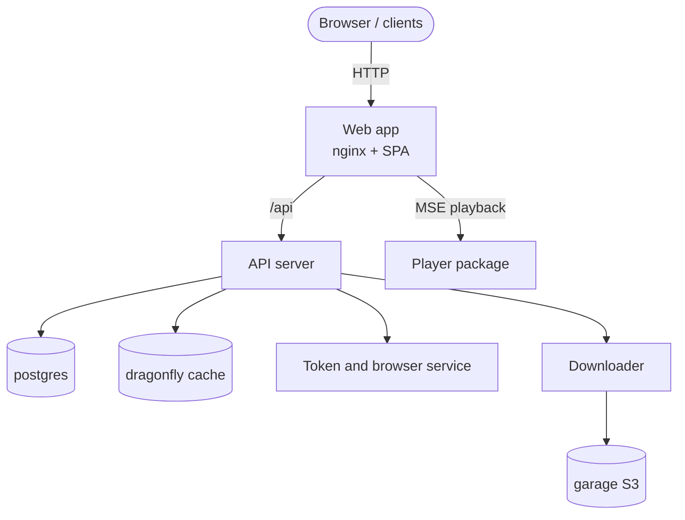

# Introduction

TypeType is not a single app, it is a **self-hostable ecosystem**. A deployment is a
set of cooperating services: a web app, an API server, a token and browser service, a
downloader, and the data stores they rely on. Together they let you run your own video
platform end to end.

This guide covers both the supported installer and a manual Docker Compose setup.
The installer creates the `.env`, generates secrets, selects free ports, and
provisions the object store. The manual path documents the same deployment as plain
commands so you can inspect and control each step.

## The components

| Component | Repository / image | Role |
| --- | --- | --- |
| Web app | `ghcr.io/typetype-video/typetype` | The interface, plus an nginx that proxies `/api` to the server |
| API server | `ghcr.io/typetype-video/typetype-server` | Accounts, extraction, the REST API, the core of the ecosystem |
| Downloader | `ghcr.io/typetype-video/typetype-downloader` | Prepares downloads and stores them in the object store |
| Token | `ghcr.io/typetype-video/typetype-token` | YouTube PO tokens, player decoding, SABR metadata, subtitles, and optional remote login |
| Database | `postgres` | Accounts, history, playlists, settings |
| Cache | `dragonfly` | Redis-compatible cache |
| Object store | `garage` | S3-compatible storage for downloads |

Other clients can use the same API server, so a single self-hosted deployment can
serve more than the web app.

## How they fit together

Only the **web app** needs to be reachable by your users. In production you put a
reverse proxy in front of it and serve it over HTTPS, as described in
[Reverse proxy and HTTPS](./reverse-proxy).

Token is an internal service, but it is not optional for current YouTube playback.
`YOUTUBE_REMOTE_LOGIN_ENABLED` controls only the interactive YouTube sign-in feature;
PO-token, decoder, subtitle, and SABR work still use Token when remote login is off.

For source ownership and the browser playback path, see the
[project overview](/project/) and [Playback and downloads](/project/playback).

## What it looks like

A self-hosted instance once it is running, playing a video, searching, and the
settings:

---

---

---

Playback in action:

## How this guide is organised

1. [Architecture](./architecture) — how the pieces communicate, and where data lives.
2. [Security boundaries](./security) — what is public, internal, and browser-backed.
3. [Prerequisites](./prerequisites) — what you need before you start.
4. [Quick start](./quick-start) — the recommended one-command install.
5. [Manual setup](./docker-compose) — the same thing by hand, step by step.
6. [Configuration](./configuration) — every environment variable, explained.
7. [Importing your data](./importing-data) — bring in subscriptions, playlists, history.
8. [Reverse proxy and HTTPS](./reverse-proxy) — exposing it on your domain.
9. [Maintenance](./maintenance) — updates, backups, and logs.
10. [Beta and main](./beta-and-main) — running the stable and preview channels.
11. [Reporting issues](./reporting-issues) — how to report bugs.
12. [Troubleshooting](./troubleshooting) — common issues and fixes.

::: tip Where do the files come from?
The `docker-compose.yml`, `nginx.conf`, `garage.toml`, and `.env.example` referenced
throughout this guide live in the TypeType repository. Clone it first (see
[Manual setup](./docker-compose) or [Quick start](./quick-start)).
:::
