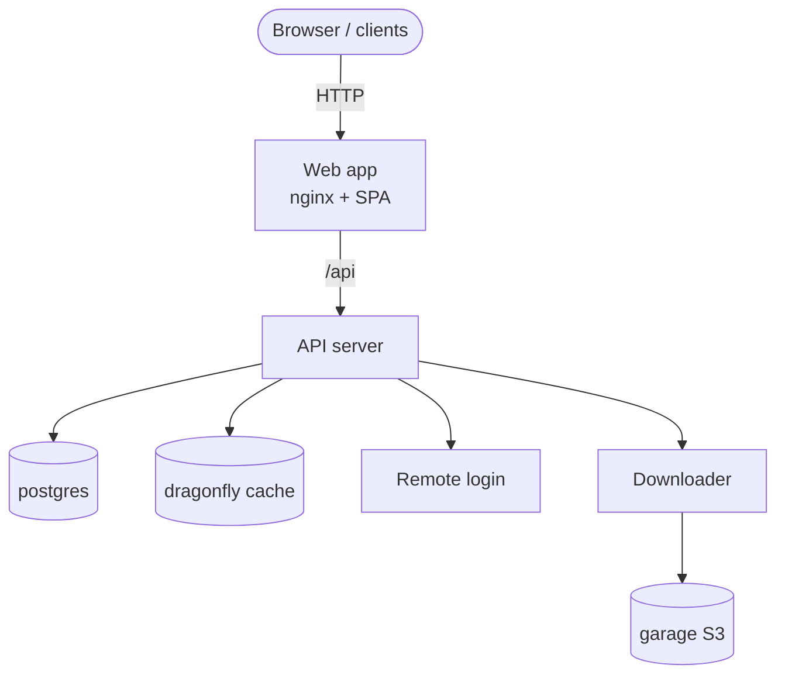

# Introduction

TypeType is not a single app, it is a **self-hostable ecosystem**. A deployment is a
set of cooperating services: a web app, an API server, a downloader, a remote-login
service, and the data stores they rely on. Together they let you run your own video
platform end to end.

This guide is for self-hosters who want to run that ecosystem **by hand**, with a
single `docker-compose.yml` and a `.env` file, without running any of the bootstrap
shell scripts shipped in the repository. Everything those scripts do (creating the
`.env`, generating secrets, provisioning the object store) is documented as plain
commands you can read and understand.

## The components

| Component | Repository / image | Role |
| --- | --- | --- |
| Web app | `ghcr.io/priveetee/typetype` | The interface, plus an nginx that proxies `/api` to the server |
| API server | `ghcr.io/priveetee/typetype-server` | Accounts, extraction, the REST API, the core of the ecosystem |
| Downloader | `ghcr.io/priveetee/typetype-downloader` | Prepares downloads and stores them in the object store |
| Remote login | `ghcr.io/priveetee/typetype-token` | Optional YouTube remote-login service |
| Database | `postgres` | Accounts, history, playlists, settings |
| Cache | `dragonfly` | Redis-compatible cache |
| Object store | `garage` | S3-compatible storage for downloads |

The ecosystem also includes clients beyond the web app (for example a native Android
client). They all talk to the same API server, so a single self-hosted deployment
serves every client.

## How they fit together

Only the **web app** needs to be reachable by your users. In production you put a
reverse proxy in front of it and serve it over HTTPS, as described in
[Reverse proxy and HTTPS](./reverse-proxy).

## What it looks like

A self-hosted instance once it is running, playing a video, searching, and the
settings:

---

---

---

Playback in action:

## How this guide is organised

1. [Architecture](./architecture) — how the pieces communicate, and where data lives.
2. [Prerequisites](./prerequisites) — what you need before you start.
3. [Quick start](./quick-start) — the recommended one-command install.
4. [Manual setup](./docker-compose) — the same thing by hand, step by step.
5. [Configuration](./configuration) — every environment variable, explained.
6. [Importing your data](./importing-data) — bring in subscriptions, playlists, history.
7. [Reverse proxy and HTTPS](./reverse-proxy) — exposing it on your domain.
8. [Maintenance](./maintenance) — updates, backups, and logs.
9. [Beta and main](./beta-and-main) — running the stable and preview channels.
10. [Reporting issues](./reporting-issues) — how to report bugs.
11. [Troubleshooting](./troubleshooting) — common issues and fixes.

::: tip Where do the files come from?
The `docker-compose.yml`, `nginx.conf`, `garage.toml`, and `.env.example` referenced
throughout this guide live in the TypeType repository. Clone it first (see
[Manual setup](./docker-compose) or [Quick start](./quick-start)).
:::
